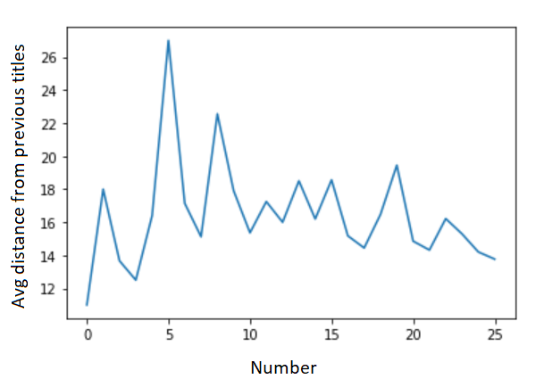

I haven't yet seen the new James Bond film <i>No Time to Die</i> but I noticed that its title sounds rather generic and uninspired. It feels almost as if all of the good James Bond film titles have already been taken. This led me to wonder whether there are underlying patterns in the titles of James Bond films, and whether it would be possible to use a computer to generate new examples.

Fortunately, there is an excellent Python library called `textgenrnn` which makes this sort of thing very easy. I have previously seen it used to generate titles of board games, with interesting results. Typically you need to train the model with your data, generate new examples, and then cherry-pick from the output, as the titles generated will have a lot of repetition. 

For example, in the board game case, you get "Card Game" and "Card Game: The Card Game" a lot, but I also got a lot of plausible-sounding board game titles such as "Panzers of the Railways", "Dice Castle", "Legends of the Wildels" and "Catatoo".

The first thing I did after I got it running was to feed in the names of the 25 Bond films, train a textgenrnn, and then have it generate output. The result was very disappointing, as it just printed out things about American Football and Donald Trump.

It turns out that my previous experiment had used 17000 pieces of text, and it is very difficult to get anything out of 25 pieces of text. If you train the model for a long time, it will start to print out things that look like Bond film titles, but unfortunately they will either be exactly the same as the film titles you put in, or else not original enough to be interesting (you will get things like "The Man with the Man with the Golden Gun".)

Searching for more data, I tossed the titles of all James Bond novels and short stories into the mix, including those written by authors other than Ian Fleming. This didn't help much, as I was still getting quite bland titles such as "Die of Bond", along with many titles of actual Bond films.

I decided that it would be a good idea to have some way to measure the distance between an output string and the titles of all existing Bond films. For this purpose, I decided to use the Levenshtein distance. For the existing 25 titles, I measured the average Levenshtein distance from all previous films, to see whether they really are getting less original over time.

</img>

The results were not conclusive, but I did decide to judge future models by looking for those which consistently generate titles which are about distance 15-16 from existing Bond film titles.

For example, I trained a model for one epoch, and then adjusted the temperature parameter (which controls the randomness of the output) in such a way that it generated texts which were on average distance 16 from existing Bond film titles. This resulted in original output, but it was not quite Bond enough. Nobody is going to pay to watch "Goldar" or "The Fit of Another Bonogs".

I tried training models for a different set of epochs and temperatures, but after a single epoch, there isn't really a difference between the models any more. Everything is controlled by the temperature. Set it too low, and you get boring titles like "Die Man" and "er. No Moonraker". Set it too high, and you get more fanciful titles like "Never Minus June Blance" and "The Red Tright".

My final experiment generated plausible titles such as "Blood Fine" and "Double or Death", but these nuggets had to be picked out from less sensible alternatives such as "The Aivencial Tenditop".

Perhaps the moral of the story is that these neural text generation models really need a human at the other end to make sense of them? Alternatively, I could go beyond Bond and add titles of other thrillers into the dataset to see whether I can generate better output. 

Research continues.
